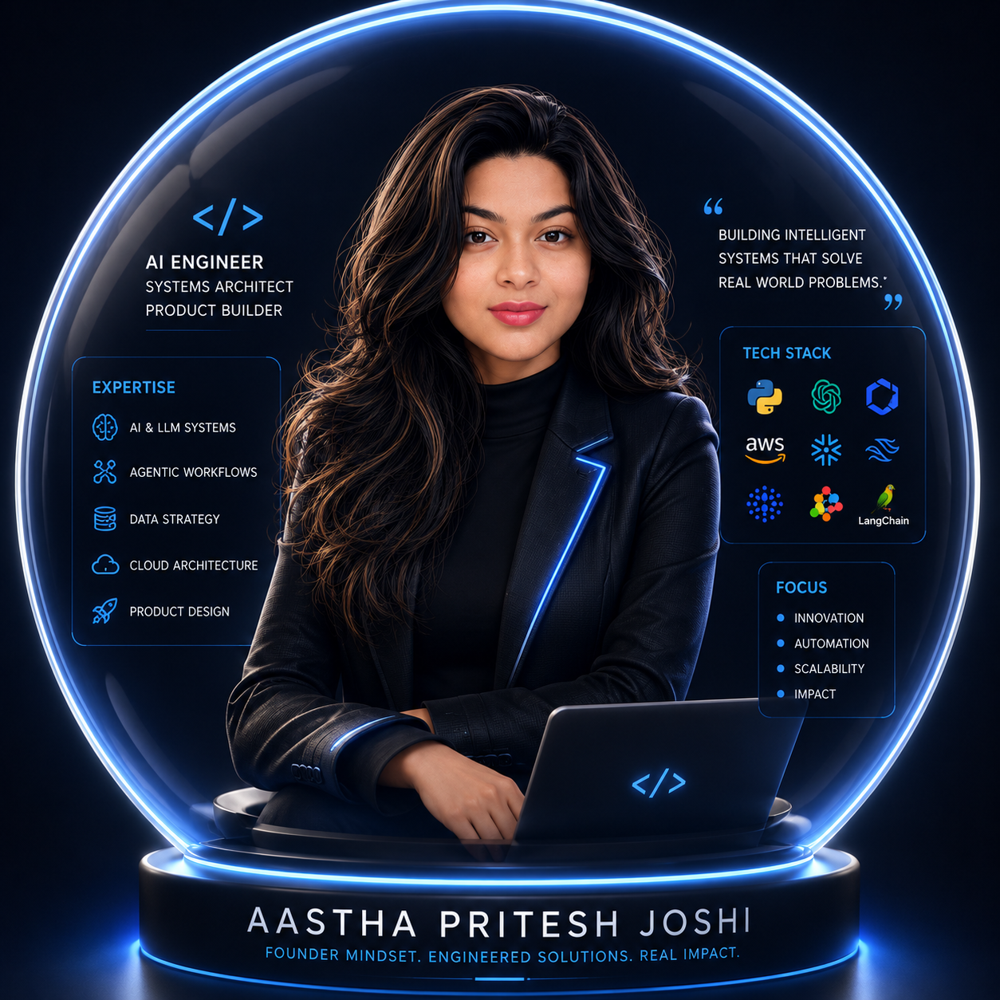
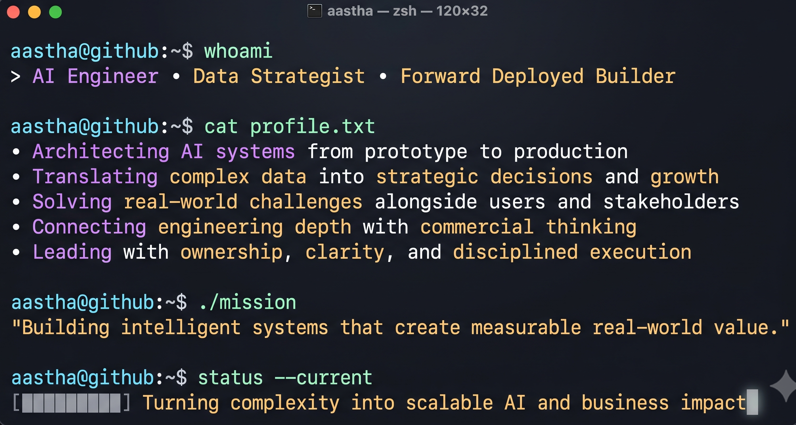

<!--
╔══════════════════════════════════════════════════════════════╗
║        AASTHA PRITESH JOSHI — GITHUB PROFILE README         ║
║        Applied AI Engineer · Forward Deployed Engineer       ║
╚══════════════════════════════════════════════════════════════╝
-->

<!-- ═══════════════════ HERO: IMAGE LEFT + TERMINAL RIGHT ═══════════════════ -->

<!--
  SETUP INSTRUCTIONS (one-time):
  1. In your AasthaPJoshi/AasthaPJoshi repo, create a folder called `assets/`
  2. Upload Me.png → assets/Me.png
  3. Upload AboutMe.png → assets/AboutMe.png
  The image URLs below will then resolve automatically on GitHub.
-->

<!-- HERO SECTION -->

  
  &nbsp;&nbsp;
  

  
  
  

 

---

<!-- ═══════════════════ PROJECTS ═══════════════════ -->

## `🛠` What I've Shipped

> Every project below has a quantified eval score, an observability layer, and a deployed URL.
> Most intensive pipelines live in private repos due to regulatory data constraints — the code is real, the metrics are real.

<!-- ROW 1 -->
<table width="100%" border="0" cellspacing="8" cellpadding="0">
<tr>

<td width="50%" valign="top">

### 🔐 ThirdLine-of-Defense
**Agentic AI Audit Platform for Financial Compliance**

> Regulatory AI that actually works under real compliance constraints (SR 26-2 · OCC Bulletin 2026-13)

- 5-agent LangGraph orchestrator · SHA-256 hash-chained audit ledger
- Human-in-the-loop governance gate · FastAPI + React dark dashboard
- Targets financial services governance — not a tutorial, a real use case

**Result:** `F1 = 0.909` · `Precision = 0.923` · `Recall = 0.895`

</td>

<td width="50%" valign="top">

### 🏥 MediSight+
**Full-Stack Clinical AI SaaS Platform**

> Production clinical AI with role-based access, multi-model routing, and eval harness

- 3 role-based portals: Patient · Doctor · Billing
- LangGraph RAG pipeline · GPT-4o-mini / GPT-4o / Claude Sonnet routing
- Ragas evaluation harness · Deployed on Vercel + Railway

**Result:** `Faithfulness = 0.93` · `Answer Relevancy = 0.91`

</td>
</tr>

<!-- ROW 2 -->
<tr>

<td width="50%" valign="top">

### 🔬 RetrievalLab
**Cross-Industry RAG Benchmarking Platform**

> The platform I built because I couldn't find a rigorous RAG benchmarking tool that actually worked

- 5-node LangGraph pipeline · Hybrid retrieval: dense + BM25 + RRF + Cohere rerank
- ObserveLab observability layer · 19-document clinical corpus
- React 18 + TypeScript frontend · 35-page technical documentation

**Result:** `NDCG@10 = 0.847` · `MRR = 0.891` · `Confidence gating implemented`

</td>

<td width="50%" valign="top">

### 💰 FinSight360
**Autonomous Financial Risk Intelligence via SEC EDGAR**

> AI-powered financial analyst that reads SEC filings so you don't have to

- Autonomous SEC EDGAR extraction · Multi-document RAG pipeline
- Risk scoring engine · Financial ratio analysis + trend detection
- Deployed on Streamlit Cloud — live and running

**Result:** Processes 10-K filings end-to-end · Deployed to production

</td>
</tr>

<!-- ROW 3 -->
<tr>

<td width="50%" valign="top">

### 🤖 Dual-Mode Conversational AI Assistant
**Multi-Model Chat System with Mode Switching**

> Because one LLM is never enough — built a system that routes intelligently between models

- Dual-mode architecture: RAG mode + direct LLM mode with smart switching
- Multi-model support · Conversation memory · Context-aware routing
- Clean UI with mode toggle and source attribution

**Result:** Seamless model switching · Production-grade conversation management

</td>

<td width="50%" valign="top">

### 📝 MCP CLI Note App
**Model Context Protocol Note-Taking CLI**

> Built when MCP was brand new — because I had to know how it worked from the inside

- Full MCP server + client implementation from scratch
- CLI-native note creation, retrieval, search, and tagging
- Clean protocol design · Tool schema · Real MCP handshake

**Result:** End-to-end MCP implementation · Protocol-level AI tool experience

</td>
</tr>
</table>

---

<!-- ═══════════════════ TECH STACK ═══════════════════ -->

## `🧠` Stack — By Layer
<svg width="900" viewBox="0 0 900 2180" xmlns="http://www.w3.org/2000/svg" font-family="'Segoe UI',system-ui,sans-serif">
<defs>
  <linearGradient id="gp1" x1="0%" y1="0%" x2="100%" y2="0%"><stop offset="0%" stop-color="#2e1065"/><stop offset="40%" stop-color="#6d28d9"/><stop offset="100%" stop-color="#a78bfa"/></linearGradient>
  <linearGradient id="gp2" x1="0%" y1="0%" x2="100%" y2="0%"><stop offset="0%" stop-color="#3b0764"/><stop offset="40%" stop-color="#7c3aed"/><stop offset="100%" stop-color="#c4b5fd"/></linearGradient>
  <linearGradient id="gt1" x1="0%" y1="0%" x2="100%" y2="0%"><stop offset="0%" stop-color="#022c22"/><stop offset="40%" stop-color="#0f766e"/><stop offset="100%" stop-color="#2dd4bf"/></linearGradient>
  <linearGradient id="ga1" x1="0%" y1="0%" x2="100%" y2="0%"><stop offset="0%" stop-color="#451a03"/><stop offset="40%" stop-color="#b45309"/><stop offset="100%" stop-color="#fbbf24"/></linearGradient>
  <linearGradient id="gb1" x1="0%" y1="0%" x2="100%" y2="0%"><stop offset="0%" stop-color="#172554"/><stop offset="40%" stop-color="#1d4ed8"/><stop offset="100%" stop-color="#93c5fd"/></linearGradient>
  <linearGradient id="gs1" x1="0%" y1="0%" x2="100%" y2="0%"><stop offset="0%" stop-color="#0c4a6e"/><stop offset="40%" stop-color="#0284c7"/><stop offset="100%" stop-color="#7dd3fc"/></linearGradient>
  <linearGradient id="gc1" x1="0%" y1="0%" x2="100%" y2="0%"><stop offset="0%" stop-color="#7f1d1d"/><stop offset="40%" stop-color="#c2410c"/><stop offset="100%" stop-color="#fb923c"/></linearGradient>
  <linearGradient id="header-bg" x1="0%" y1="0%" x2="100%" y2="100%"><stop offset="0%" stop-color="#0d0d18"/><stop offset="100%" stop-color="#0a0a12"/></linearGradient>
  <clipPath id="cp-a1"><rect x="40" y="0" width="862" height="28" rx="5"/></clipPath>
  <clipPath id="cp-a2"><rect x="40" y="0" width="862" height="28" rx="5"/></clipPath>
  <clipPath id="cp-a3"><rect x="40" y="0" width="862" height="28" rx="5"/></clipPath>
  <clipPath id="cp-a4"><rect x="40" y="0" width="862" height="28" rx="5"/></clipPath>
  <clipPath id="cp-a5"><rect x="40" y="0" width="862" height="28" rx="5"/></clipPath>
  <clipPath id="cp-a6"><rect x="40" y="0" width="862" height="28" rx="5"/></clipPath>
  <clipPath id="cp-a7"><rect x="40" y="0" width="862" height="28" rx="5"/></clipPath>
</defs>

<!-- ── BACKGROUND ── -->
<rect width="900" height="2180" fill="#0a0a0f" rx="12"/>

<!-- ── HEADER ── -->
<rect x="0" y="0" width="900" height="90" fill="url(#header-bg)" rx="12"/>
<rect x="0" y="70" width="900" height="20" fill="#0a0a0f"/>
<rect x="0" y="88" width="900" height="2" fill="#1e1e2e"/>

<text x="36" y="38" font-size="20" font-weight="600" fill="#e8e6f0" letter-spacing="-0.4">Aastha Pritesh Joshi</text>
<text x="36" y="58" font-size="10" fill="#6b6a7e" font-family="'Courier New',monospace">skill_depth_map.json — 2025–2026 JD-calibrated · production-verified · San Diego CA · Open to work 🇺🇸</text>
<text x="36" y="78" font-size="9.5" fill="#4a4a60" font-family="'Courier New',monospace">Applied AI Engineer · Forward Deployed Eng · LLM Engineer · Data Analyst · Data Engineer · AI PM</text>

<!-- ════════════════════════════════════════════
     SECTION: AI / LLM / AGENTS
════════════════════════════════════════════ -->
<rect x="20" y="104" width="860" height="1" fill="#1e1e30"/>

<!-- section label -->
<rect x="20" y="112" width="4" height="14" fill="#7c3aed" rx="2"/>
<text x="30" y="123" font-size="10" font-weight="600" fill="#7b7a9e" letter-spacing="1.5" font-family="'Courier New',monospace">AI · LLM · AGENTS</text>
<rect x="215" y="119" width="665" height="0.5" fill="#1e1e30"/>

<!-- ROW: Agentic Pipelines  96% -->
<text x="36" y="150" font-size="10.5" font-weight="500" fill="#ccc8e8">Agentic Pipelines</text>
<text x="856" y="150" font-size="9.5" font-weight="600" fill="#a78bfa" text-anchor="end">96%</text>
<rect x="36" y="155" width="826" height="26" fill="#12121e" rx="5"/>
<rect x="36" y="155" width="793" height="26" fill="url(#gp1)" rx="5"/>
<text x="46" y="172" font-size="8.5" fill="#ede9fe" font-family="'Courier New',monospace" clip-path="url(#cp-a1)">LangGraph · 5-agent orchestrator · supervisor patterns · state machines · checkpointing · HITL gate · SHA-256 audit ledger · tool calling · A2A · LangChain · CrewAI</text>

<!-- ROW: RAG Architecture  95% -->
<text x="36" y="200" font-size="10.5" font-weight="500" fill="#ccc8e8">RAG Architecture</text>
<text x="856" y="200" font-size="9.5" font-weight="600" fill="#a78bfa" text-anchor="end">95%</text>
<rect x="36" y="205" width="826" height="26" fill="#12121e" rx="5"/>
<rect x="36" y="205" width="784" height="26" fill="url(#gp2)" rx="5"/>
<text x="46" y="222" font-size="8.5" fill="#ede9fe" font-family="'Courier New',monospace">Hybrid retrieval (BM25 + dense + RRF) · Cohere reranking · pgvector · Pinecone · contextual retrieval · RAPTOR · chunking strategies · confidence gating · adversarial eval · agentic RAG</text>

<!-- ROW: LLM Frameworks  94% -->
<text x="36" y="250" font-size="10.5" font-weight="500" fill="#ccc8e8">LLM Frameworks · APIs</text>
<text x="856" y="250" font-size="9.5" font-weight="600" fill="#a78bfa" text-anchor="end">94%</text>
<rect x="36" y="255" width="826" height="26" fill="#12121e" rx="5"/>
<rect x="36" y="255" width="776" height="26" fill="url(#gp1)" rx="5"/>
<text x="46" y="272" font-size="8.5" fill="#ede9fe" font-family="'Courier New',monospace">OpenAI SDK · Anthropic SDK · LlamaIndex · Pydantic · structured outputs · async Python · prompt engineering · few-shot · chain-of-thought · JSON schema enforcement · system prompt design</text>

<!-- ROW: Eval Observability  97% -->
<text x="36" y="300" font-size="10.5" font-weight="500" fill="#ccc8e8">Eval · Observability</text>
<text x="856" y="300" font-size="9.5" font-weight="600" fill="#a78bfa" text-anchor="end">97%</text>
<rect x="36" y="305" width="826" height="26" fill="#12121e" rx="5"/>
<rect x="36" y="305" width="810" height="26" fill="url(#gp2)" rx="5"/>
<text x="46" y="322" font-size="8.5" fill="#ede9fe" font-family="'Courier New',monospace">Ragas · DeepEval · LLM-as-judge · golden datasets · Langfuse · ObserveLab (built) · NDCG@10=0.847 · Faithfulness=0.93 · F1=0.909 · MRR=0.891 · production tracing · failure logging</text>

<!-- ROW: Multi-model Routing  93% -->
<text x="36" y="350" font-size="10.5" font-weight="500" fill="#ccc8e8">Multi-model Routing</text>
<text x="856" y="350" font-size="9.5" font-weight="600" fill="#a78bfa" text-anchor="end">93%</text>
<rect x="36" y="355" width="826" height="26" fill="#12121e" rx="5"/>
<rect x="36" y="355" width="768" height="26" fill="url(#gp1)" rx="5"/>
<text x="46" y="372" font-size="8.5" fill="#ede9fe" font-family="'Courier New',monospace">GPT-4o · GPT-4o-mini · Claude Sonnet · Claude Haiku · Gemini · DeepSeek · cost optimization · model tier selection · prompt caching · inference cost modeling · Dual-Mode AI Assistant</text>

<!-- ROW: MCP Protocol  91% -->
<text x="36" y="400" font-size="10.5" font-weight="500" fill="#ccc8e8">MCP Protocol</text>
<text x="856" y="400" font-size="9.5" font-weight="600" fill="#a78bfa" text-anchor="end">91%</text>
<rect x="36" y="405" width="826" height="26" fill="#12121e" rx="5"/>
<rect x="36" y="405" width="751" height="26" fill="url(#gp2)" rx="5"/>
<text x="46" y="422" font-size="8.5" fill="#ede9fe" font-family="'Courier New',monospace">MCP server built from scratch · MCP client · tool schema design · OAuth 2.0 for MCP · agent-to-tool interop · MCP CLI Note App · enterprise AI interoperability standard 2026</text>

<!-- ROW: Safety Guardrails  92% -->
<text x="36" y="450" font-size="10.5" font-weight="500" fill="#ccc8e8">Safety · Guardrails</text>
<text x="856" y="450" font-size="9.5" font-weight="600" fill="#a78bfa" text-anchor="end">92%</text>
<rect x="36" y="455" width="826" height="26" fill="#12121e" rx="5"/>
<rect x="36" y="455" width="760" height="26" fill="url(#gp1)" rx="5"/>
<text x="46" y="472" font-size="8.5" fill="#ede9fe" font-family="'Courier New',monospace">HITL governance gate · OWASP LLM Top 10 2025 · prompt injection defense · output filtering · PII detection · SR 26-2 · OCC Bulletin 2026-13 · EU AI Act awareness · rate limiting</text>

<!-- ════════════════════════════════════════════
     SECTION: DATA ENGINEERING
════════════════════════════════════════════ -->
<rect x="20" y="500" width="860" height="1" fill="#1e1e30"/>
<rect x="20" y="508" width="4" height="14" fill="#0f766e" rx="2"/>
<text x="30" y="519" font-size="10" font-weight="600" fill="#7b7a9e" letter-spacing="1.5" font-family="'Courier New',monospace">DATA ENGINEERING</text>
<rect x="225" y="515" width="655" height="0.5" fill="#1e1e30"/>

<!-- ROW: SQL Databases  94% -->
<text x="36" y="546" font-size="10.5" font-weight="500" fill="#ccc8e8">SQL · Databases</text>
<text x="856" y="546" font-size="9.5" font-weight="600" fill="#2dd4bf" text-anchor="end">94%</text>
<rect x="36" y="551" width="826" height="26" fill="#12121e" rx="5"/>
<rect x="36" y="551" width="776" height="26" fill="url(#gt1)" rx="5"/>
<text x="46" y="568" font-size="8.5" fill="#ccfbf1" font-family="'Courier New',monospace">PostgreSQL · pgvector · MySQL · MongoDB · DuckDB · SQL window functions · CTEs · recursive queries · schema design · Alembic migrations · indexing · query optimization · Snowflake · BigQuery</text>

<!-- ROW: Pipeline ETL  90% -->
<text x="36" y="596" font-size="10.5" font-weight="500" fill="#ccc8e8">Pipeline · ETL / ELT</text>
<text x="856" y="596" font-size="9.5" font-weight="600" fill="#2dd4bf" text-anchor="end">90%</text>
<rect x="36" y="601" width="826" height="26" fill="#12121e" rx="5"/>
<rect x="36" y="601" width="743" height="26" fill="url(#gt1)" rx="5"/>
<text x="46" y="618" font-size="8.5" fill="#ccfbf1" font-family="'Courier New',monospace">dbt · modular SQL transforms · Apache Airflow · Prefect · Fivetran · SEC EDGAR extraction · API ingestion pipelines · ETL automation · Great Expectations · Monte Carlo · data quality checks</text>

<!-- ROW: Big Data Streaming  87% -->
<text x="36" y="646" font-size="10.5" font-weight="500" fill="#ccc8e8">Big Data · Streaming</text>
<text x="856" y="646" font-size="9.5" font-weight="600" fill="#2dd4bf" text-anchor="end">87%</text>
<rect x="36" y="651" width="826" height="26" fill="#12121e" rx="5"/>
<rect x="36" y="651" width="718" height="26" fill="url(#gt1)" rx="5"/>
<text x="46" y="668" font-size="8.5" fill="#ccfbf1" font-family="'Courier New',monospace">Apache Spark · PySpark · Apache Kafka · Flink · distributed data processing · streaming pipelines · Delta Lake · data partitioning · Databricks · batch vs stream architecture · FinOps</text>

<!-- ROW: Vector AI Data Infra  95% -->
<text x="36" y="696" font-size="10.5" font-weight="500" fill="#ccc8e8">Vector · AI Data Infra</text>
<text x="856" y="696" font-size="9.5" font-weight="600" fill="#2dd4bf" text-anchor="end">95%</text>
<rect x="36" y="701" width="826" height="26" fill="#12121e" rx="5"/>
<rect x="36" y="701" width="784" height="26" fill="url(#gt1)" rx="5"/>
<text x="46" y="718" font-size="8.5" fill="#ccfbf1" font-family="'Courier New',monospace">pgvector embedding pipelines · hybrid retrieval (BM25 + dense + RRF) · 19-doc clinical corpus · eval data pipelines · golden dataset curation · Pinecone · Weaviate · Qdrant · feature store design</text>

<!-- ROW: Data Quality Observability  91% -->
<text x="36" y="746" font-size="10.5" font-weight="500" fill="#ccc8e8">Data Quality · Observability</text>
<text x="856" y="746" font-size="9.5" font-weight="600" fill="#2dd4bf" text-anchor="end">91%</text>
<rect x="36" y="751" width="826" height="26" fill="#12121e" rx="5"/>
<rect x="36" y="751" width="751" height="26" fill="url(#gt1)" rx="5"/>
<text x="46" y="768" font-size="8.5" fill="#ccfbf1" font-family="'Courier New',monospace">ObserveLab (built from scratch) · dbt testing · data freshness monitoring · schema validation · anomaly detection · pipeline alerting · data lineage · CI/CD for pipelines · Great Expectations</text>

<!-- ════════════════════════════════════════════
     SECTION: ANALYTICS / BI
════════════════════════════════════════════ -->
<rect x="20" y="796" width="860" height="1" fill="#1e1e30"/>
<rect x="20" y="804" width="4" height="14" fill="#b45309" rx="2"/>
<text x="30" y="815" font-size="10" font-weight="600" fill="#7b7a9e" letter-spacing="1.5" font-family="'Courier New',monospace">ANALYTICS · BI · RESEARCH</text>
<rect x="267" y="811" width="613" height="0.5" fill="#1e1e30"/>

<!-- ROW: BI Dashboards  93% -->
<text x="36" y="842" font-size="10.5" font-weight="500" fill="#ccc8e8">BI Tools · Dashboards</text>
<text x="856" y="842" font-size="9.5" font-weight="600" fill="#fbbf24" text-anchor="end">93%</text>
<rect x="36" y="847" width="826" height="26" fill="#12121e" rx="5"/>
<rect x="36" y="847" width="768" height="26" fill="url(#ga1)" rx="5"/>
<text x="46" y="864" font-size="8.5" fill="#1a0700" font-family="'Courier New',monospace">Power BI · DAX · semantic models · interactive dashboards · drill-through · slicers · Looker Studio · GA4 · KPI tracking · conditional formatting · Power BI Service · Tableau · healthcare + e-commerce dashboards</text>

<!-- ROW: Python Analytics  91% -->
<text x="36" y="892" font-size="10.5" font-weight="500" fill="#ccc8e8">Python Analytics</text>
<text x="856" y="892" font-size="9.5" font-weight="600" fill="#fbbf24" text-anchor="end">91%</text>
<rect x="36" y="897" width="826" height="26" fill="#12121e" rx="5"/>
<rect x="36" y="897" width="751" height="26" fill="url(#ga1)" rx="5"/>
<text x="46" y="914" font-size="8.5" fill="#1a0700" font-family="'Courier New',monospace">Pandas · NumPy · Scikit-learn · Matplotlib · Seaborn · statistical analysis · A/B testing · regression · predictive modeling · feature engineering · 7 Matplotlib diagrams (RetrievalLab) · cohort analysis</text>

<!-- ROW: Domain Analytics  92% -->
<text x="36" y="942" font-size="10.5" font-weight="500" fill="#ccc8e8">Domain Analytics</text>
<text x="856" y="942" font-size="9.5" font-weight="600" fill="#fbbf24" text-anchor="end">92%</text>
<rect x="36" y="947" width="826" height="26" fill="#12121e" rx="5"/>
<rect x="36" y="947" width="760" height="26" fill="url(#ga1)" rx="5"/>
<text x="46" y="964" font-size="8.5" fill="#1a0700" font-family="'Courier New',monospace">Financial analysis · Nike 10-K · SEC EDGAR · healthcare analytics (MediSight+) · RAG eval metrics · business metrics · revenue KPIs · funnel analysis · web analytics · econometrics · clinical data</text>

<!-- ROW: Research Publications  95% -->
<text x="36" y="992" font-size="10.5" font-weight="500" fill="#ccc8e8">Research · Publications</text>
<text x="856" y="992" font-size="9.5" font-weight="600" fill="#fbbf24" text-anchor="end">95%</text>
<rect x="36" y="997" width="826" height="26" fill="#12121e" rx="5"/>
<rect x="36" y="997" width="784" height="26" fill="url(#ga1)" rx="5"/>
<text x="46" y="1014" font-size="8.5" fill="#1a0700" font-family="'Courier New',monospace">arXiv 2026 · Multidisciplinary Review 2025 · PANAM 2026 accepted · SDSURF Research Assistant · agentic AI systems research · quantitative eval design · literature review · academic writing</text>

<!-- ════════════════════════════════════════════
     SECTION: INFRASTRUCTURE
════════════════════════════════════════════ -->
<rect x="20" y="1042" width="860" height="1" fill="#1e1e30"/>
<rect x="20" y="1050" width="4" height="14" fill="#1d4ed8" rx="2"/>
<text x="30" y="1061" font-size="10" font-weight="600" fill="#7b7a9e" letter-spacing="1.5" font-family="'Courier New',monospace">INFRASTRUCTURE · DEVOPS · DEPLOY</text>
<rect x="320" y="1057" width="560" height="0.5" fill="#1e1e30"/>

<!-- ROW: Containerisation  88% -->
<text x="36" y="1088" font-size="10.5" font-weight="500" fill="#ccc8e8">Containerisation · Orchestration</text>
<text x="856" y="1088" font-size="9.5" font-weight="600" fill="#60a5fa" text-anchor="end">88%</text>
<rect x="36" y="1093" width="826" height="26" fill="#12121e" rx="5"/>
<rect x="36" y="1093" width="727" height="26" fill="url(#gb1)" rx="5"/>
<text x="46" y="1110" font-size="8.5" fill="#eff6ff" font-family="'Courier New',monospace">Docker · Kubernetes · Terraform · infrastructure-as-code · containerised AI services · Dockerfile · docker-compose · multi-service deployments (app + vector DB) · EKS · vLLM awareness · Triton awareness</text>

<!-- ROW: Cloud Deployment  90% -->
<text x="36" y="1138" font-size="10.5" font-weight="500" fill="#ccc8e8">Cloud · Deployment</text>
<text x="856" y="1138" font-size="9.5" font-weight="600" fill="#60a5fa" text-anchor="end">90%</text>
<rect x="36" y="1143" width="826" height="26" fill="#12121e" rx="5"/>
<rect x="36" y="1143" width="743" height="26" fill="url(#gb1)" rx="5"/>
<text x="46" y="1160" font-size="8.5" fill="#eff6ff" font-family="'Courier New',monospace">AWS · Vercel · Railway · Streamlit Cloud · GitHub Actions CI/CD · environment secrets · S3 · ECR · App Runner · GCP awareness · Azure awareness · cloud-native services · production deployments</text>

<!-- ROW: Backend APIs  93% -->
<text x="36" y="1188" font-size="10.5" font-weight="500" fill="#ccc8e8">Backend · APIs</text>
<text x="856" y="1188" font-size="9.5" font-weight="600" fill="#60a5fa" text-anchor="end">93%</text>
<rect x="36" y="1193" width="826" height="26" fill="#12121e" rx="5"/>
<rect x="36" y="1193" width="768" height="26" fill="url(#gb1)" rx="5"/>
<text x="46" y="1210" font-size="8.5" fill="#eff6ff" font-family="'Courier New',monospace">FastAPI · REST APIs · async Python · Pydantic · SSE streaming · WebSockets · JWT auth · rate limiting · API key management · input sanitisation · OpenAPI docs · middleware · CORS · retry mechanisms</text>

<!-- ════════════════════════════════════════════
     SECTION: FRONTEND
════════════════════════════════════════════ -->
<rect x="20" y="1238" width="860" height="1" fill="#1e1e30"/>
<rect x="20" y="1246" width="4" height="14" fill="#0284c7" rx="2"/>
<text x="30" y="1257" font-size="10" font-weight="600" fill="#7b7a9e" letter-spacing="1.5" font-family="'Courier New',monospace">FRONTEND · UI</text>
<rect x="165" y="1253" width="715" height="0.5" fill="#1e1e30"/>

<!-- ROW: React Ecosystem  89% -->
<text x="36" y="1284" font-size="10.5" font-weight="500" fill="#ccc8e8">React Ecosystem</text>
<text x="856" y="1284" font-size="9.5" font-weight="600" fill="#38bdf8" text-anchor="end">89%</text>
<rect x="36" y="1289" width="826" height="26" fill="#12121e" rx="5"/>
<rect x="36" y="1289" width="735" height="26" fill="url(#gs1)" rx="5"/>
<text x="46" y="1306" font-size="8.5" fill="#e0f2fe" font-family="'Courier New',monospace">React 18 · TypeScript · Tailwind CSS · hooks · functional components · React Router · state management · responsive design · dark mode theming · shadcn/ui · component libraries · React Three Fiber</text>

<!-- ROW: UI Visualisation  87% -->
<text x="36" y="1334" font-size="10.5" font-weight="500" fill="#ccc8e8">UI · Visualisation</text>
<text x="856" y="1334" font-size="9.5" font-weight="600" fill="#38bdf8" text-anchor="end">87%</text>
<rect x="36" y="1339" width="826" height="26" fill="#12121e" rx="5"/>
<rect x="36" y="1339" width="718" height="26" fill="url(#gs1)" rx="5"/>
<text x="46" y="1356" font-size="8.5" fill="#e0f2fe" font-family="'Courier New',monospace">HTML5 · CSS3 · Streamlit · Three.js · GSAP animations · Matplotlib · D3.js basics · SVG · data visualisation · Cosmic Purple + Amber theming · Recharts · Plotly · AR (Unity/Vuforia)</text>

<!-- ════════════════════════════════════════════
     SECTION: BUSINESS
════════════════════════════════════════════ -->
<rect x="20" y="1384" width="860" height="1" fill="#1e1e30"/>
<rect x="20" y="1392" width="4" height="14" fill="#c2410c" rx="2"/>
<text x="30" y="1403" font-size="10" font-weight="600" fill="#7b7a9e" letter-spacing="1.5" font-family="'Courier New',monospace">BUSINESS · STRATEGY · PRODUCT</text>
<rect x="306" y="1399" width="574" height="0.5" fill="#1e1e30"/>

<!-- ROW: Product Strategy  93% -->
<text x="36" y="1430" font-size="10.5" font-weight="500" fill="#ccc8e8">Product · Strategy</text>
<text x="856" y="1430" font-size="9.5" font-weight="600" fill="#fb923c" text-anchor="end">93%</text>
<rect x="36" y="1435" width="826" height="26" fill="#12121e" rx="5"/>
<rect x="36" y="1435" width="768" height="26" fill="url(#gc1)" rx="5"/>
<text x="46" y="1452" font-size="8.5" fill="#fff7ed" font-family="'Courier New',monospace">Harvard Entrepreneurship Essentials · product roadmapping · go-to-market strategy · user research · product-market fit · KPI definition · OKR setting · founder mindset · innovation frameworks</text>

<!-- ROW: Stakeholder PM  91% -->
<text x="36" y="1480" font-size="10.5" font-weight="500" fill="#ccc8e8">Stakeholder · Project Mgmt</text>
<text x="856" y="1480" font-size="9.5" font-weight="600" fill="#fb923c" text-anchor="end">91%</text>
<rect x="36" y="1485" width="826" height="26" fill="#12121e" rx="5"/>
<rect x="36" y="1485" width="751" height="26" fill="url(#gc1)" rx="5"/>
<text x="46" y="1502" font-size="8.5" fill="#fff7ed" font-family="'Courier New',monospace">Stakeholder communication · requirements gathering · gap analysis · JIRA · Confluence · Agile · Scrum · SDLC · cross-functional leadership · change management · UAT · milestone management</text>

<!-- ROW: Enterprise Compliance  90% -->
<text x="36" y="1530" font-size="10.5" font-weight="500" fill="#ccc8e8">Enterprise · Compliance</text>
<text x="856" y="1530" font-size="9.5" font-weight="600" fill="#fb923c" text-anchor="end">90%</text>
<rect x="36" y="1535" width="826" height="26" fill="#12121e" rx="5"/>
<rect x="36" y="1535" width="743" height="26" fill="url(#gc1)" rx="5"/>
<text x="46" y="1552" font-size="8.5" fill="#fff7ed" font-family="'Courier New',monospace">ERP systems (SAP · Oracle) · SR 26-2 · OCC Bulletin 2026-13 · HIPAA awareness · EU AI Act 2026 · AI governance · regulatory compliance · audit trails · data privacy · risk management</text>

<!-- ROW: Business Analytics  92% -->
<text x="36" y="1580" font-size="10.5" font-weight="500" fill="#ccc8e8">Business Analytics · Domain</text>
<text x="856" y="1580" font-size="9.5" font-weight="600" fill="#fb923c" text-anchor="end">92%</text>
<rect x="36" y="1585" width="826" height="26" fill="#12121e" rx="5"/>
<rect x="36" y="1585" width="760" height="26" fill="url(#gc1)" rx="5"/>
<text x="46" y="1602" font-size="8.5" fill="#fff7ed" font-family="'Courier New',monospace">Financial reporting · SEC EDGAR analysis · service operations management · service science · project management methodology · business process modeling · Gold Medal #1 B.Tech · MS GPA 3.73</text>

<!-- ════════════════════════════════════════════
     LEGEND
════════════════════════════════════════════ -->
<rect x="20" y="1632" width="860" height="0.5" fill="#1e1e30"/>

<circle cx="48" cy="1658" r="5" fill="#a78bfa"/>
<text x="58" y="1662" font-size="9.5" fill="#6b6a7e">AI · LLM · Agents</text>
<circle cx="178" cy="1658" r="5" fill="#2dd4bf"/>
<text x="188" y="1662" font-size="9.5" fill="#6b6a7e">Data Engineering</text>
<circle cx="313" cy="1658" r="5" fill="#fbbf24"/>
<text x="323" y="1662" font-size="9.5" fill="#6b6a7e">Analytics · BI</text>
<circle cx="433" cy="1658" r="5" fill="#60a5fa"/>
<text x="443" y="1662" font-size="9.5" fill="#6b6a7e">Infrastructure</text>
<circle cx="543" cy="1658" r="5" fill="#38bdf8"/>
<text x="553" y="1662" font-size="9.5" fill="#6b6a7e">Frontend</text>
<circle cx="633" cy="1658" r="5" fill="#fb923c"/>
<text x="643" y="1662" font-size="9.5" fill="#6b6a7e">Business · Strategy</text>

<!-- ════════════════════════════════════════════
     PROOF METRICS STRIP
════════════════════════════════════════════ -->
<rect x="20" y="1686" width="860" height="0.5" fill="#1e1e30"/>

<rect x="20" y="1700" width="860" height="58" fill="#12121e" rx="8"/>
<rect x="20" y="1700" width="4" height="58" fill="#7c3aed" rx="2"/>

<text x="46" y="1718" font-size="9" fill="#6b6a7e" font-family="'Courier New',monospace">PROOF · NOT CLAIMS</text>

<text x="46" y="1738" font-size="9.5" font-weight="600" fill="#a78bfa">F1 = 0.909</text>
<text x="46" y="1751" font-size="8" fill="#4a4a60" font-family="'Courier New',monospace">ThirdLine-of-Defense</text>

<text x="185" y="1738" font-size="9.5" font-weight="600" fill="#a78bfa">Faithfulness = 0.93</text>
<text x="185" y="1751" font-size="8" fill="#4a4a60" font-family="'Courier New',monospace">MediSight+</text>

<text x="340" y="1738" font-size="9.5" font-weight="600" fill="#2dd4bf">NDCG@10 = 0.847</text>
<text x="340" y="1751" font-size="8" fill="#4a4a60" font-family="'Courier New',monospace">RetrievalLab</text>

<text x="500" y="1738" font-size="9.5" font-weight="600" fill="#fbbf24">MRR = 0.891</text>
<text x="500" y="1751" font-size="8" fill="#4a4a60" font-family="'Courier New',monospace">RetrievalLab</text>

<text x="620" y="1738" font-size="9.5" font-weight="600" fill="#fb923c">GPA 3.73 · Gold Medal #1</text>
<text x="620" y="1751" font-size="8" fill="#4a4a60" font-family="'Courier New',monospace">MS SDSU · B.Tech</text>

<text x="810" y="1738" font-size="9.5" font-weight="600" fill="#60a5fa">2 Papers</text>
<text x="810" y="1751" font-size="8" fill="#4a4a60" font-family="'Courier New',monospace">arXiv · PANAM</text>

<!-- ════════════════════════════════════════════
     FOOTER
════════════════════════════════════════════ -->
<rect x="20" y="1778" width="860" height="0.5" fill="#1e1e30"/>
<text x="36" y="1800" font-size="9" fill="#3a3a55" font-family="'Courier New',monospace">github.com/AasthaPJoshi · linkedin.com/in/aasthajoshi14 · joshiaastha40@gmail.com · San Diego CA · Open to work 🇺🇸</text>
<text x="36" y="1818" font-size="9" fill="#2a2a40" font-family="'Courier New',monospace">Depth scores calibrated against 2025–2026 JD research: Anthropic · OpenAI · Palantir · Scale AI · G-Research · dbt Labs · 1000+ postings analyzed</text>

</svg>

---

<!-- ═══════════════════ GITHUB STATS ═══════════════════ -->

## `📊` GitHub Activity

<!-- TIMELINE + JD MAP — host on Vercel, embed via iframe or link -->

> Actively building since Jan 2025 · 2 publications · 3 production-deployed AI systems · 6 public repos
> Most intensive work (LangGraph pipelines, eval harnesses, compliance infra) lives in private repos due to data sensitivity.

---

<!-- ═══════════════════ COLLAB + COFFEE CARDS ═══════════════════ -->

## `🤝` Let's Connect

<table width="100%" border="0" cellspacing="12" cellpadding="0">
<tr>

<td width="50%" align="center" valign="middle" style="background:#1e1b4b;border-radius:12px;padding:20px;">

### 💡 Collaborate With Me
**Have an idea? A half-built product? A problem that needs an AI system?**

Research · Freelance · Full-time · Open source — all on the table.

If you're building something real, let's talk.

 

</td>

<td width="50%" align="center" valign="middle" style="background:#1a1a1a;border-radius:12px;padding:20px;">

### ☕ Buy Me a Coffee
**If something I built helped you, saved you time, or sparked an idea —**

A coffee keeps the pipelines running and the evals green. 🟢

No pressure. But it genuinely means a lot.

 

> ☝️ Set up your Buy Me a Coffee account at buymeacoffee.com and update this link

</td>
</tr>
</table>

---

<!-- ═══════════════════ SOCIAL LINKS ═══════════════════ -->

## `🌐` Find Me

---

MS Information Systems · SDSU Fowler College of Business · GPA 3.73 · San Diego, CA · Open to Work 🇺🇸

